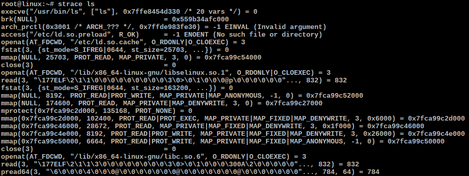
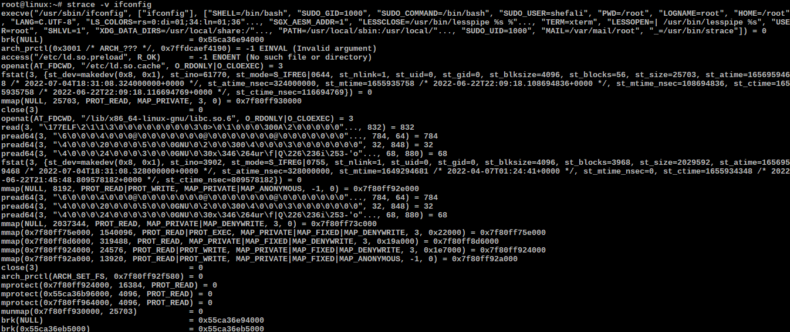
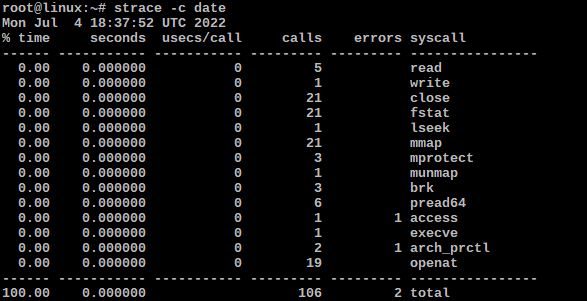
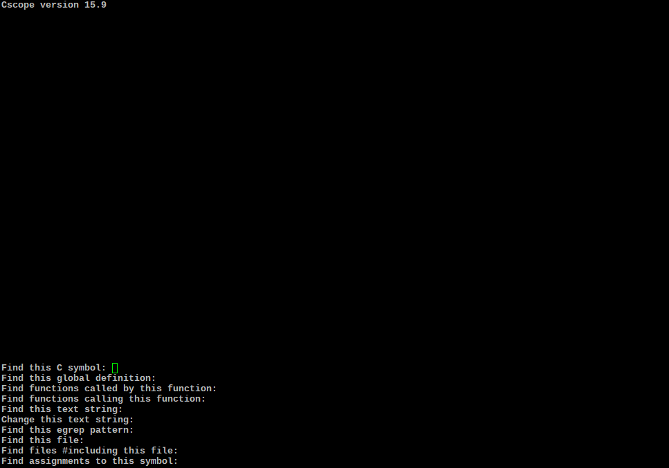
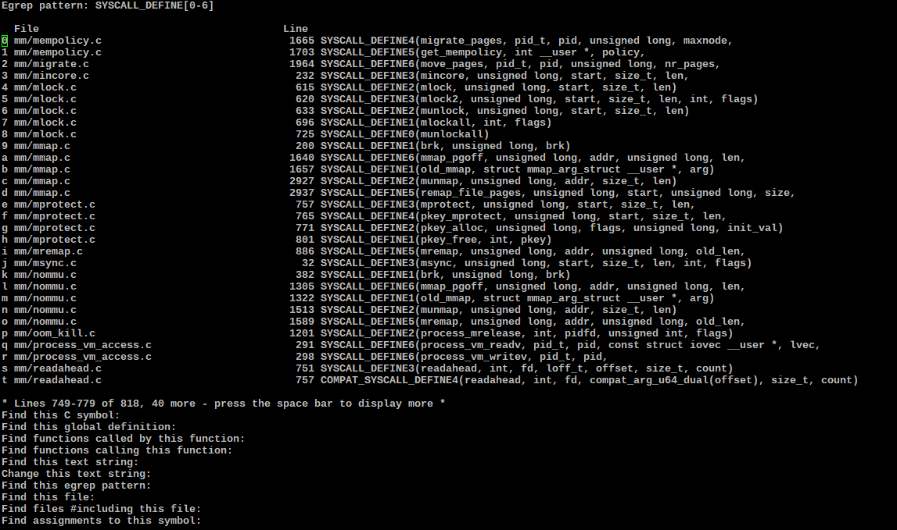

## Discovering Linux kernel subsystems used by a workload
#### Key Points
- Understanding system resources necessary to build and run a workload is important.
- Linux tracing and strace can be used to discover the system resources in use by a workload.
- Performance and security of the operating system can be analyzed with the help of tools like perf, stress-ng, paxtest.
- Once we discover and understand the workload needs, we can focus on them to avoid regressions and use it to evaluate safety considerations.

In our previous blog [Discovery Linux Kernel Subsystems used by OpenAPS](https://elisa.tech/blog/2022/02/02/discovery-linux-kernel-subsystems-used-by-openaps/), we gathered a higher level of information about the OpenAPS usage. It isn’t ideal that this higher information doesn’t tell us the system usage by individual OpenAPS commands. As an example, we won’t be able to clearly identify which system calls are invoked when a user queries insulin pump status.

Continuing on our work, we identified a process for gathering fine grained information about system resources necessary to run a workload on Linux. This process can then be applied to any workload including individual OpenAPS commands and important use-cases. As an example, what subsystems are used when a user queries the insulin pump status. 

We chose an easily available [strace](https://man7.org/linux/man-pages/man1/strace.1.html) which is a useful diagnostic, instructional, and debugging tool and can be used to discover the system resources in use by a workload. Once we discover and understand the workload needs, we can focus on them to avoid regressions and use it to evaluate safety considerations.

#### How did we gather fine grained system information?

We used the strace command to trace the perf,  stress-ng, paxtest workloads. System calls are the fundamental interface between an application and the operating system kernel. They enable a program to request services from the kernel. For instance, the open() system call in Linux is used to provide access to a file in the file system. **strace** enables us to track all the system calls made by an application. It lists all the system calls made by a process with the outputs of those calls.

#### Get the system ready for tracing

Before we can get started we will have to get our system ready. We assume that you have a Linux distro running on a physical system or virtual machine. Most distributions will include **strace command**. Let’s install other tools that aren’t usually included to build Linux kernel. Please note that the following works on Debian based distributions. You might have to find equivalent packages on other Linux distributions.

- **Install tools to build Linux kernel and tools in kernel repo.**
  - **sudo apt-get build-essentials flex bison yacc**
  - **sudo apt install libelf-dev systemtap-sdt-dev libaudit-dev libslang2-dev libperl-dev libdw-dev**
- **Browsing kernel sources**
  - **sudo apt-get install cscope**
- **Install stress-ng**
  - **apt-get install stress-ng**
- **Install paxtest**
  - **apt-get install paxtest**

We plan to use strace to trace perf bench, stress-ng and paxtest workloads to show you how to analyze a workload and identify Linux subsystems used by these workloads. We hope you will be able to apply this process to trace your workload(s).

- **perf bench (all) workload:**
  - The perf bench command contains multiple multithreaded microkernel benchmarks for executing different subsystems in the Linux kernel and system calls. This allows us to easily measure the impact of changes, which can help mitigate performance regressions. It also acts as a common benchmarking framework, enabling developers to easily create test cases, integrate transparently, and use performance-rich tooling subsystems.
- **Stress-ng netdev stressor workload:**
  - stress-ng is used for performing stress testing on the kernel. It allows you to exercise various physical subsystems of the computer, as well as interfaces of the OS kernel, using "stressors". They are available for CPU, CPU cache, devices, I/O, interrupts, file system, memory, network, operating system, pipelines, schedulers, virtual machines. You may find the description of all the available stressors here. The netdev stressor starts N  workers  that  exercise  various  netdevice ioctl commands across all the available network devices.
- **paxtest kiddie workload:**
  - paxtest is a program that tests buffer overflows in the kernel. It tests kernel enforcements over memory usage. Generally, execution in some memory segments makes buffer overflows possible. It runs a set of programs that attempt to subvert memory usage. It is used as a regression test suite for PaX, but might be useful to test other memory protection patches for the kernel. We plan to use paxtest kiddie mode which looks for simple vulnerabilities.

#### What is strace and how do we use it?
As mentioned earlier, strace which is a useful diagnostic, instructional, and debugging tool and can be used to discover the system resources in use by a workload. It can be used:
- To see how a process interacts with the kernel.
- To see why a process is failing or hanging.
- For reverse engineering a process.
- To find the files on which a program depends.
- For analyzing the performance of an application.
- For troubleshooting various problems related to the operating system.

In addition, strace can generate run-time statistics on time, calls, and errors for each system call and  re‐port  a  summary  on  program exit, suppressing the regular output.  This attempts to show system time (CPU time  spent running  in the kernel) independent of wall clock time. We plan to use these features to get information on workload system usage. Let’s get started with a few **strace** example runs of basic, verbose, and stats modes. We are going to use the “-c” option for gathering fine grained information. Let’s first look at a few examples on how to use “strace”.

###### Usage: `strace <command we want to trace>`
The following image shows "**strace ls**" output which shows system usage by “ls” command as it uses Linux System Calls to find and list information about the FILEs that reside under a directory.

###### Verbose mode usage: `strace -v <command>`
strace command when run in verbose mode gives more detailed information about the system calls. The following image shows “**strace -v ifconfig**” output.

###### Gather statistics
We can use the -c parameter to generate a report of total time, calls and errors for each system call - `strace -c <command>`. The following image shows “**strace -c date**” output that includes a summary of system usage statistics for “date” command.

#### What is cscope and how do we use it?
Now let’s look at **cscope**, a command line tool for browsing C, C++ or Java codebases. We can use it to find all the references to a symbol, global definitions, functions called by a function, functions calling a function, text strings, regular expression patterns, files including a file.

We can use cscope to find which system call belongs to which subsystem. This way we can find the kernel subsystems used by a process when it is executed. To use it navigate to the source code directory. Here we are analyzing the kernel source tree.

First let’s checkout the latest Linux repository and build cscope database:
- **git clone git://git.kernel.org/pub/scm/linux/kernel/git/torvalds/linux.git linux**
- **cd linux**
- **cscope -R -p10 or cscope -d -p10**
  
Note: Run **cscope -R** to build the database (run it only once) and **cscope -d -p10** to enter into the interactive mode of cscope. To get out of this mode press **ctrl+d**.

All the system calls are defined in the kernel using the SYSCALL_DEFINE[0-6] macro in their respective subsystem directory. We can search for this egrep pattern to find all the system calls and their subsystems (Press the Tab key to go back to the cscope options). 

#### Perf

Perf is an analysis tool based on Linux 2.6+ systems, which abstracts the CPU hardware difference in performance measurement in Linux, and provides a simple command line interface. Perf is based on the perf_events interface exported by the kernel. It is very useful for profiling the system and finding performance bottlenecks in an application.

If you haven't already checkout the Linux mainline repository, you can do so and then build kernel and perf tool:
- **git clone git://git.kernel.org/pub/scm/linux/kernel/git/torvalds/linux.git linux**
- **cd linux**
- **make -j3 all**
- **cd tools/perf**
- **make**
  
The following image shows the “make perf” output:

